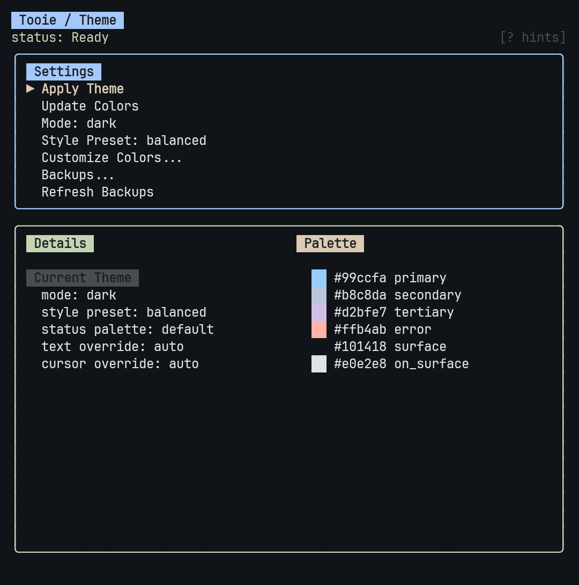

# Tooie

Tooie is a single command center for your Termux launcher setup.

It combines:
- a Bubble Tea TUI for dashboard, theme, and launcher workflows
- CLI commands for app discovery, icon caching, app launch, and launcher restart
- install scripts that deploy a usable Termux baseline

## Screenshots

Home page:


Search / launcher row:



## Install

```sh
cd ~/files/tooie
./install.sh
```

## Run

```sh
~/.local/bin/tooie
# or
~/.config/tooie/tooie
```

## CLI

```sh
tooie --help
tooie --restart
tooie apps
tooie apps --refresh
tooie launch com.termux
tooie launch com.termux/.app.TermuxActivity
tooie exec "am start -n com.termux/.app.TermuxActivity --user 0"
tooie icon com.termux
tooie icons refresh --pinned
```

## Installed Paths

The installer places files here:

- binary: `~/.local/bin/tooie`
- runtime copy and helper scripts: `~/.config/tooie/`
- app cache: `~/.cache/tooie/apps.json`
- icon cache: `~/.cache/tooie/icons/`
- pinned apps: `~/.config/tooie/pinned-apps.json`
- theme backups: `~/.config/tooie/backups/`
- installer safety backups: `~/.local/state/tooie/backups/<timestamp>/`

## What `install.sh` Deploys

- `~/.tmux.conf`
- `~/.termux/termux.properties`
- `~/.termux/colors.properties`
- `~/.termux/font.ttf`
- `~/.termux/font-italic.ttf`
- `~/.config/starship.toml`
- `~/.config/fish/config.fish`
- `~/.config/peaclock/config`
- `~/.config/tmux/`
- `~/.config/nvim/`
- `~/.config/tooie/tooie`
- `~/.config/tooie/apply-material.sh`
- `~/.config/tooie/restore-material.sh`
- `~/.config/tooie/list-material-backups.sh`

It supports both `pkg` and `pacman`.

## CLI Notes

- `tooie apps` caches launcher app discovery in `~/.cache/tooie/apps.json`.
- `tooie icon <package>` caches backend-delivered icons in `~/.cache/tooie/icons/`.
- `tooie icons refresh --pinned` refreshes pinned-app icons, preferring backend icon routes first.
- `tooie launch` prefers the Tooie `/v1/exec` endpoint, then falls back to local `am start`.
- `tooie --restart` force-stops and relaunches `termux-launcher`.

## Uninstall

```sh
cd ~/files/tooie
./uninstall.sh
```

Current uninstall behavior removes only the installed binaries:

- `~/.local/bin/tooie`
- `~/.config/tooie/tooie`

Configs, helper scripts, and backups are left in place.
