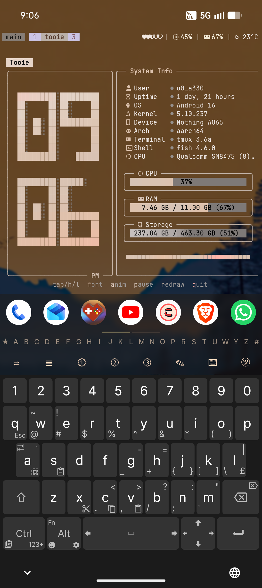
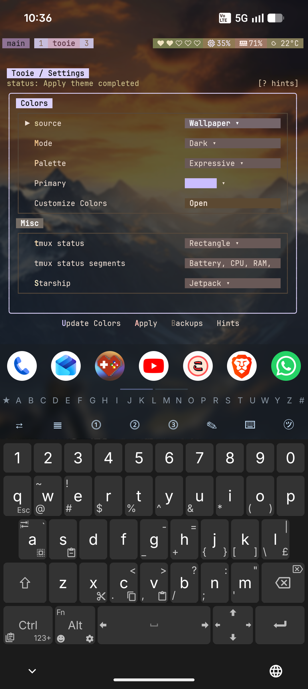
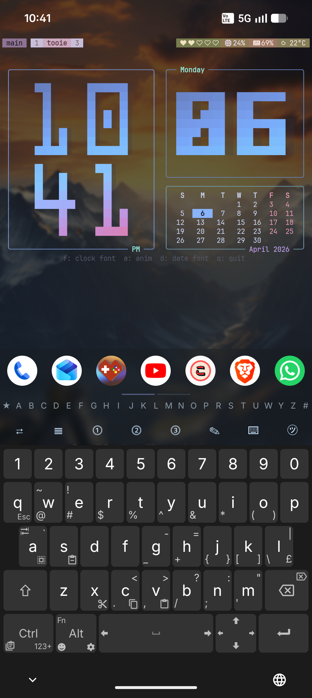
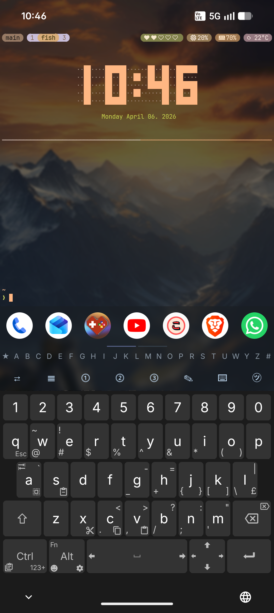

# Tooie

Tooie is a small dashboard and theme manager for Termux and Linux.

It gives you:
- a full-screen TUI for theme control and quick system info
- a guided installer for `tmux`, `fish`, `starship`, `peaclock`, and terminal colors
- mini modes for a clock, a calendar, or both together
- wallpaper-based theme generation with fixed presets
- tmux widgets that work on both Linux and Termux

## Screenshots

### Tooie


### Tooie Settings


### `tooie --clock --cal`


### Shell + Peaclock


## Install

Clone the main branch and run the installer:

```sh
git clone https://github.com/PickleHik3/tooie.git
cd tooie
./install.sh
```

The installer will:
- ask which platform you want to target
- ask which items you want to theme
- install the needed packages
- build `tooie`
- run guided setup

For Termux, the installer supports these backends:
- `none`
- `rish`
- `root`
- `shizuku`

If you enable the remote `btop` helper, Tooie will set up `btop` and `mini-btop` aliases for `fish`.

## Build Only

If you only want the binary:

```sh
go build -o ~/.local/bin/tooie ./cmd/tooie
chmod +x ~/.local/bin/tooie
```

## Main Commands

```sh
tooie
tooie /path/to/wallpaper.jpg
tooie setup
tooie doctor
tooie --clock
tooie --cal
tooie --clock --cal
tooie theme apply --theme-source wallpaper --mode dark
tooie theme compute --theme-source preset --preset-family tokyo-night --preset-variant night
tooie helper btop setup --runner rish
tooie helper uninstall --snapshot latest
```

## What The TUI Does

The main TUI has two pages:
- the dashboard page with the clock and live status
- the settings page for theme source, presets, widgets, and shell options

From the TUI you can:
- switch between wallpaper themes and preset themes
- change tmux widget settings
- switch starship presets
- apply the current theme

## Wallpaper Workflow

You can start Tooie like this:

```sh
tooie /path/to/wallpaper.jpg
```

That saves the wallpaper path and opens the TUI. Tooie then uses that image for theme generation.

## Installed Paths

Tooie installs and manages files in these locations:

- binary: `~/.local/bin/tooie`
- settings: `~/.config/tooie/settings.json`
- managed config root: `~/.config/tooie/`
- managed theme files: `~/.config/tooie/configs/`
- backups: `~/.config/tooie/backups/`
- helper stats: `~/.cache/tooie/helper-stats.json`
- install snapshots: `~/.local/state/tooie/install/snapshots/`

## Uninstall

```sh
cd ~/.tmp/tooie
./uninstall.sh
```

If a setup snapshot exists, Tooie restores from that snapshot. If not, it removes the installed binary only.

## Credits

- Clock font work in Tooie was created with `bit` by superstarryeyes:
  https://github.com/superstarryeyes/bit
- Uses JetBrainsMono NF:
  https://github.com/JetBrains/JetBrainsMono
