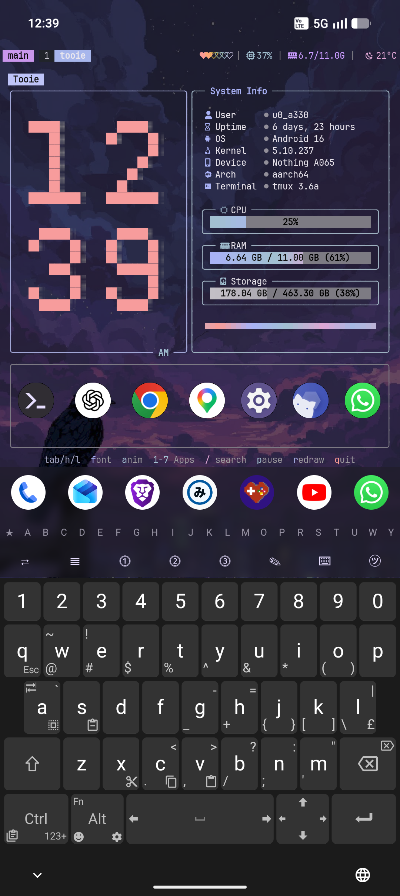
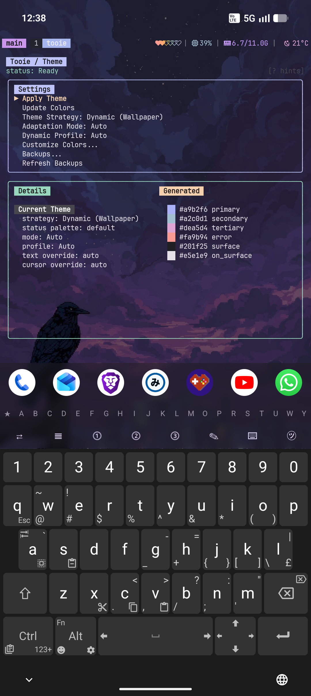
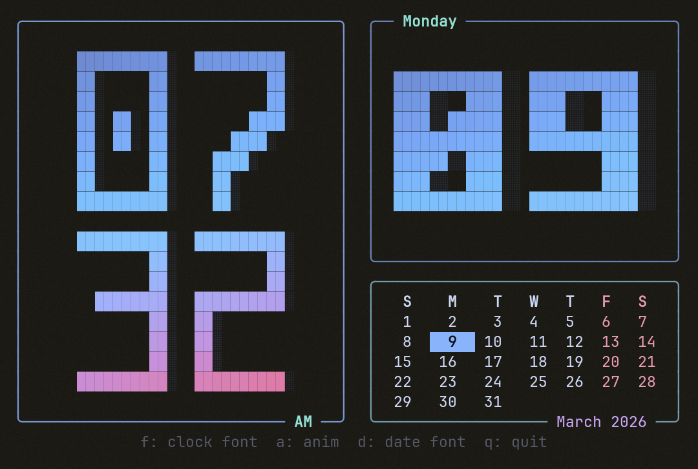
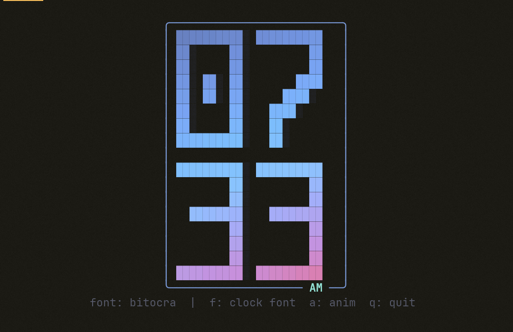
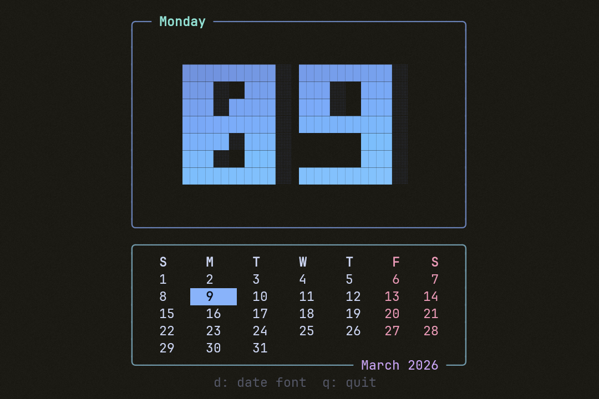

# Tooie

This is a companion bootstrap script + TUI for Termux/Linux shell environments.

What it does:
- Installs necessary packages (`tmux`, `fish`, `starship`, `zoxide`, `eza`, `go`, `matugen`, etc.)
- Copies over config files to their respective locations (~/.config & ~/.termux)
- Builds the 'tooie' binary and places it at ~/.local/bin/tooie
- Runs a guided setup with platform profile selection

## Usage Notes

Press keybind "prefix + i" to bring up quick reference to the tmux keybinds. The prefix is "Ctrl + b" and "Ctrl + Space".

The TUI is split into 2 pages:
- First page includes the clock and live system stats.
- Second page is a merged theme/status screen. The top row contains theme controls and the generated palette view. The bottom row contains tmux status widget toggles (`battery`, `cpu`, `ram`, `weather`) and their current on/off state summary.
- Theme generation still uses `matugen` against the terminal background at `~/.termux/background/`, now with native extraction controls (source index / prefer modes) and fixed preset themes available from the merged page.

## Screenshots

### Home


### Theme


### `tooie --clock --cal`


### `tooie --clock`


### `tooie --cal`


## Install

Quick install from `v2-dev`:

```sh
git clone --branch v2-dev --single-branch https://github.com/PickleHik3/tooie.git
cd tooie
./install.sh
```

`install.sh` now asks:
- platform (`termux` or `linux`)
- termux backend (if termux): `none`, `rish`, `root`, `shizuku`
- themed items (single choice)
- final summary + confirm

## Clone + Build Binary Only

```sh
git clone --branch v2-dev --single-branch https://github.com/PickleHik3/tooie.git
cd tooie
go build -o ~/.local/bin/tooie ./cmd/tooie
chmod +x ~/.local/bin/tooie
```

Then run:

```sh
~/.local/bin/tooie
```

## Run

```sh
~/.local/bin/tooie
```

## CLI

```sh
tooie --help
tooie --clock
tooie --cal
tooie --clock --cal
tooie setup
tooie doctor
tooie helper btop setup --runner auto
tooie helper uninstall --snapshot latest
tooie theme compute --theme-source preset --preset-family catppuccin --preset-variant mocha
tooie theme apply --theme-source wallpaper --mode auto --status-palette vibrant
```

## Installed Paths

The installer places files here:

- binary: `~/.local/bin/tooie`
- Tooie managed root: `~/.config/tooie/`
- managed config container: `~/.config/tooie/configs/`
- theme backups: `~/.config/tooie/backups/`
- install snapshots (for restore on uninstall): `~/.local/state/tooie/install/snapshots/<timestamp>/`

## What `install.sh` Deploys

- `~/.config/tooie/configs/tmux/`
- `~/.config/tooie/configs/tmux/tmux.conf`
- `~/.config/tooie/configs/termux/*`
- `~/.config/tooie/configs/fish/config.fish`
- `~/.config/tooie/configs/starship.toml`
- `~/.config/tooie/configs/peaclock/config`
- tmux bootstrap in `~/.tmux.conf`
- fish snippet in `~/.config/fish/conf.d/tooie.fish` (when shell theming is selected)
- symlinked fixed-path consumers (`~/.termux/*`, `~/.config/peaclock/config`) when selected
- `~/.config/tooie/apply-material.sh`
- `~/.config/tooie/restore-material.sh`
- `~/.config/tooie/list-material-backups.sh`
- `~/.config/tooie/reset-bootstrap-defaults.sh`
- `~/.config/tooie/setup-btop-helper.sh`

Supported package managers in installer: `pkg`, `pacman`, `apt`, `dnf`.

## CLI Notes

- `tooie theme apply` is the runtime theme engine for Termux, tmux, peaclock, and starship.
- `~/.config/tooie/apply-material.sh` is a compatibility shim that forwards to `tooie theme apply`.
- `tooie --clock` starts the low-CPU standalone clock widget.
- `tooie --cal` starts the low-CPU standalone date/month calendar widget.
- `tooie --clock --cal` starts the side-by-side clock + calendar widget view.

## Uninstall

```sh
cd ~/.tmp/tooie
./uninstall.sh
```
The script restores files from the latest install snapshot when available.  
Fallback behavior (if no snapshot exists): remove only `~/.local/bin/tooie`.

## Acknowledgements

- Clock font work in Tooie was created with `bit` by superstarryeyes:
  https://github.com/superstarryeyes/bit
- Uses JetBrainsMono NF:
  https://github.com/JetBrains/JetBrainsMono
