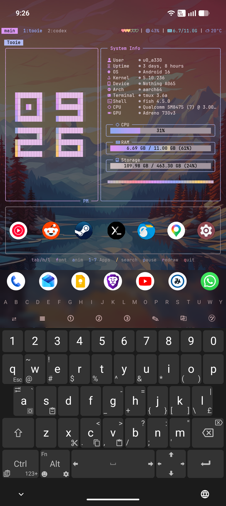
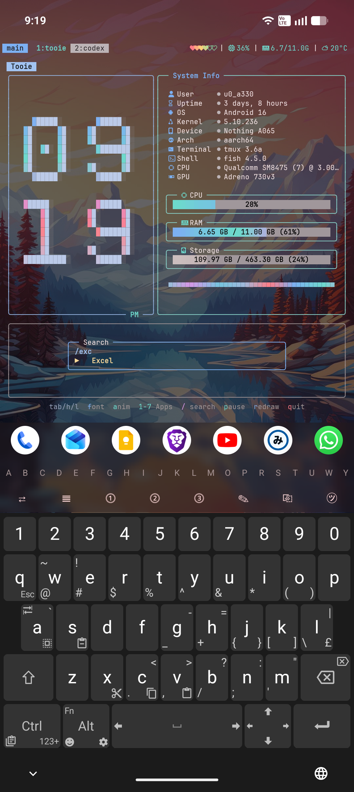
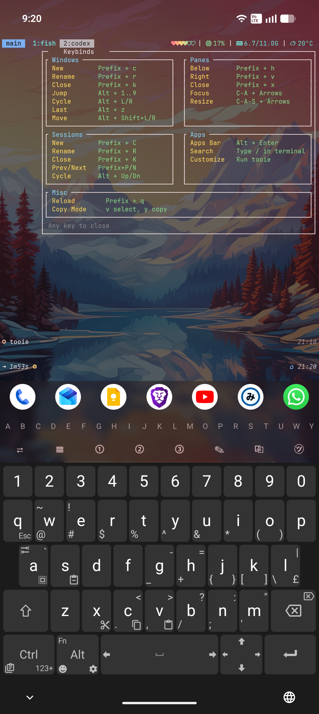
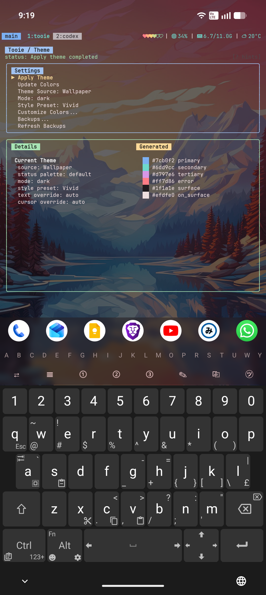
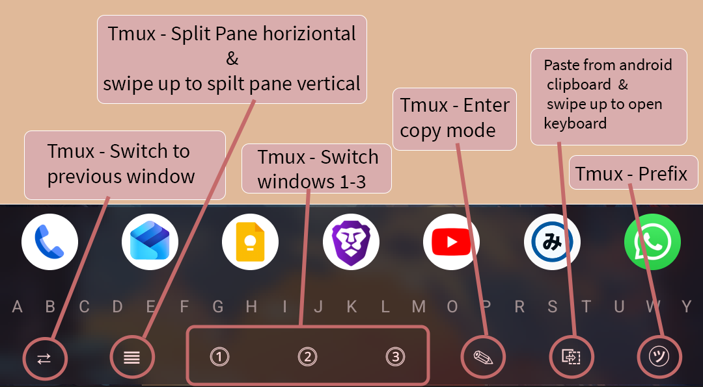

# Tooie

This is a companion bootstrap script + TUI I vibe-coded for my Termux launcher for Android: https://github.com/PickleHik3/termux-launcher. As such, I do not expect it to work in other Termux setups.

What it does:
- Installs necessary packages (`tmux`, `fish`, `starship`, `zoxide`, `eza`, `go`, `matugen`, etc.)
- Copies over config files to their respective locations (~/.config & ~/.termux)
- Builds the 'tooie' binary and places it at ~/.local/bin/tooie

## Usage Notes

Press keybind "prefix + i" to bring up quick reference to the tmux keybinds. The prefix is "Ctrl + b" and "Ctrl + Space".

The TUI is split into 2 pages:
- First page includes the clock, live system stats and an android app launcher.
  - Pressing `/` brings up app search. From there you can press `Ctrl+p` to pin the highlighted app to the home screen.
  - Pinned apps can be launched directly by pressing their respective number keys `1-7`.
- Second page includes color scheme controls. It uses `matugen` to generate color palettes from the terminal background situated at `~/.termux/background/`. Optionally, you can override some of the extracted colors and specify various pre-defined styles as well as preset themes.

## Screenshots

<table>
  <tr>
    <td></td>
    <td></td>
  </tr>
  <tr>
    <td></td>
    <td></td>
  </tr>
  <tr>
    <td colspan="2" align="center"></td>
  </tr>
</table>

## Install

```sh
pkg update -y
pkg i -y git
termux-setup-storage
git clone https://github.com/PickleHik3/tooie
cd ~/tooie
./install.sh
chsh -s fish
~/.local/bin/tooie --restart
```

## Run

```sh
~/.local/bin/tooie
```

## CLI

```sh
tooie --help
tooie --restart
tooie apps
tooie apps --refresh
tooie launch com.termux
tooie launch com.termux/.app.TermuxActivity
tooie exec "am start -n com.termux/.app.TermuxActivity --user 0"
tooie icon com.termux
tooie icons refresh --pinned
```

## Installed Paths

The installer places files here:

- binary: `~/.local/bin/tooie`
- Tooie helper scripts and state files: `~/.config/tooie/`
- app cache: `~/.cache/tooie/apps.json`
- icon cache: `~/.cache/tooie/icons/`
- pinned apps: `~/.config/tooie/pinned-apps.json`
- theme backups: `~/.config/tooie/backups/`
- installer safety backups: `~/.local/state/tooie/backups/<timestamp>/`

## What `install.sh` Deploys

- `~/.tmux.conf`
- `~/.termux/termux.properties`
- `~/.termux/colors.properties`
- `~/.termux/font.ttf`
- `~/.termux/font-italic.ttf`
- `~/.termux/bin/`
- `~/.config/starship.toml`
- `~/.config/fish/config.fish`
- `~/.config/peaclock/config`
- `~/.config/tmux/`
- `~/.config/tooie/apply-material.sh`
- `~/.config/tooie/restore-material.sh`
- `~/.config/tooie/list-material-backups.sh`

It supports both `pkg` and `pacman`.

## CLI Notes

- `tooie apps` caches launcher app discovery in `~/.cache/tooie/apps.json`.
- `tooie icon <package>` caches backend-delivered icons in `~/.cache/tooie/icons/`.
- `tooie icons refresh --pinned` refreshes pinned-app icons, preferring backend icon routes first.
- `tooie launch` prefers the Tooie `/v1/exec` endpoint, then falls back to local `am start`.
- `tooie --restart` force-stops and relaunches `termux-launcher`.

## Uninstall

```sh
rm ~/.local/bin/tooie
rm -rf ~/.config/tooie
```
or
```sh
cd ~/tooie
./uninstall.sh
```
The script removes only the installed binary at `~/.local/bin/tooie`. Configs, helper scripts, and backups are left in place.

## Acknowledgements

- Clock font work in Tooie was created with `bit` by superstarryeyes:
  https://github.com/superstarryeyes/bit
- Uses JetBrainsMono NF:
  https://github.com/JetBrains/JetBrainsMono
